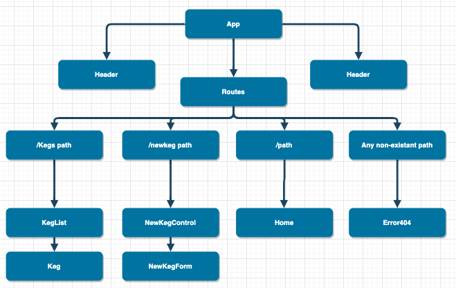

# _Tap Room_

#### _Tap room with your favorite beers, February 15th, 2020_

#### By _**Judah Barton**_

## Description

_This is a react based app where you will be able to view the beers we have on tap and as an employee you can subtract the amount of pints left after you sell a beer. You are also able to add a new beer as well as edit the current beer._

## Setup/Installation Requirements
* _Click the clone or download button and copy the link_
* _open your terminal and type "git clone (link)"_
* _Navigate to the root directory of your project_
* _In Terminal run 'npm install'_
* _In Terminal run 'npm start'_

## Behavior-Driven Development
|  Behavior | Input  | Output  |
|---|---|---|

## Known Bugs

_None_

## Support and contact details

_example@you.com_

## Technologies Used

* _React_
* _Javascript_

### License

*This software is licensed under the MIT license agreement*

Copyright (c) 2020 **_Judah Barton_**
